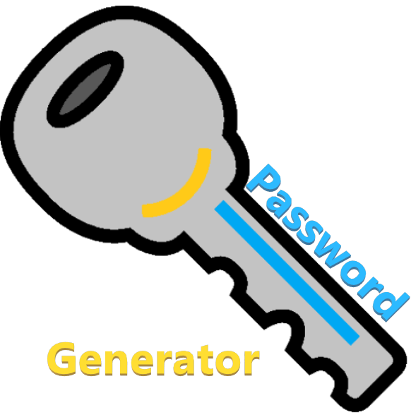

# Password Generator

> Lucas Rennó Kallás | [Git: lucasrennok](https://github.com/lucasrennok "lucasrennok")

> Rafael Antunes Vieita | [Git: Rav98](https://github.com/Rav98 "Rav98")

## About the Site
This project is a web site that create a password for you, based on the configuration that you put in the "Config" button. You have only to click on "Generate" to create a password at the first position of the list. If you want one more password you have to click at "+" button, the it will add one more place at the list to generate. Everytime you press "Generate" the first position of the list is replaced with a new password. The same as the "Delete" button, you will delete the first place of the list, so it will delete the password too and the list will be atualized. If the checkbox near to the "Delete" button is checked, all the passwords from the list will be removed if the you press "Delete". The button "Download" create an archive "passwords.txt" with all the passwords that you generated.

### Configuration
Config button is to select the caracters that you want on your password.

* Quantity: the length of the password that you want to generate(have to be a number bigger than 0).
* abc: if you want lowercase caracters from the alphabet in your password(not necessarily obligated to be in the created word).
* ABC: if you want uppercase caracters from the alphabet in your password(not necessarily obligated to be in the created word).
* 123: if you want numbers in your passwords(not necessarily obligated to be in the created word).
* #$%: if you want special caracters in your password(not necessarily obligated to be in the created word).
* All selected: if you want that all the above checkboxes that were checked obligate the caracters to appear in the password.
